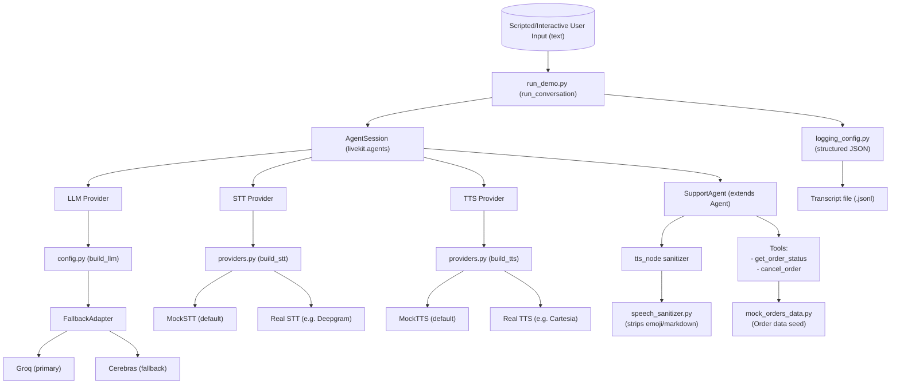

# Section 1 — LiveKit Agents (Real-time Voice AI)

A minimal voice-agent pipeline built on the real `livekit-agents` SDK
(`AgentSession` + `Agent` + `@function_tool`), with STT/TTS mocked via text
I/O and a real LLM (Groq, with an automatic Cerebras fallback) making the
actual tool-calling decisions.

See [`NOTES.md`](./NOTES.md) for the write-up (barge-in extension, safe
second-tool pattern, and the Task 1.2 bonus), [`SWAPPING_PROVIDERS.md`](./SWAPPING_PROVIDERS.md)
for a detailed guide to swapping or adding STT/TTS providers, and
[`CONVERSATIONS.md`](./CONVERSATIONS.md) for the real live-run
transcripts in plain English.

## Setup (should take under 10 minutes on any machine with Python 3.10+)

```bash
# 1. from this folder:
python3 -m venv venv
source venv/bin/activate          # Windows: venv\Scripts\activate

# 2. install dependencies
pip install -r requirements.txt

# 3. get a free LLM API key (no credit card needed) -- pick one:
#    Groq:     https://console.groq.com/keys
#    Cerebras: https://cloud.cerebras.ai
cp .env.example .env
#    ...then paste your key into .env as GROQ_API_KEY (or CEREBRAS_API_KEY)

# 4. run the tests (no API key needed for this step)
pytest tests/ -v

# 5. run the live demo (this step needs the API key from step 3)
python src/run_demo.py
```

That's it — step 5 prints a live transcript of the agent handling a short
order-status/cancellation conversation and writes a structured JSON log to
`transcripts/`.

Want to type your own messages instead of the scripted conversation?

```bash
python src/run_demo.py --interactive
```

By default the console shows just the readable conversation (plus one
compact `tool_call: (name, args, OK/ERROR: result)` line per tool call).
Add `--verbose` to also see the full structured JSON log stream on the
console (HTTP requests, retries, fallback events) -- useful for debugging.
The full JSON transcript file is always written either way.

## Swapping STT/TTS providers (Task 1.2)

Default is mock (zero setup). To try a real provider instead:

```bash
pip install -r requirements-optional-providers.txt
# then add to .env:
#   STT_PROVIDER=deepgram
#   DEEPGRAM_API_KEY=...      (free trial, no card: console.deepgram.com)
#   TTS_PROVIDER=cartesia
#   CARTESIA_API_KEY=...      (free trial, no card: play.cartesia.ai)
python src/run_demo.py
```

No code changes needed -- see `src/providers.py` and `NOTES.md` section 3.

## What's in here

---

---
```
src/
  config.py              LLM provider setup: Groq primary, Cerebras fallback
                          (via the SDK's real llm.FallbackAdapter)
  providers.py            build_stt()/build_tts(): mock by default, real
                          Deepgram/Cartesia via env vars (Task 1.2)
  logging_config.py       Structured JSON logging (console + transcript file)
  mock_providers.py       MockSTT / MockTTS -- real subclasses of the SDK's
                          stt.STT / tts.TTS base classes, backed by text I/O
  mock_orders_data.py     THE mock order data -- edit this file to add,
                          remove, or change test orders
  speech_sanitizer.py     Strips emoji/markdown before text reaches TTS
  persona.py              SupportAgent(Agent): persona, the 2 function
                          tools, and the tts_node sanitization hook
  run_demo.py             Entrypoint: builds the session, runs the demo
tests/
  fakes.py                  ScriptedLLM: offline, deterministic LLM
                          stand-in used ONLY in tests (see NOTES.md for why)
  test_tools.py              Unit tests for both tools (happy + error paths)
  test_mock_providers.py     Unit tests for MockSTT/MockTTS against the
                          real SDK interface
  test_providers.py          Unit tests for build_stt()/build_tts() --
                          proves the provider swap actually works
  test_speech_sanitizer.py   Unit tests for the emoji/markdown stripper
  test_persona_tts_node.py   Proves SupportAgent.tts_node actually
                          sanitizes before reaching the real TTS pipeline
  test_agent_integration.py  End-to-end AgentSession test using ScriptedLLM
                          -- proves the wiring is correct with no network
transcripts/
  README.md                 How to generate the real evidence transcript
  offline_smoke_test_transcript.txt  Plumbing-verification transcript
                          (explicitly NOT the required real-LLM evidence)
NOTES.md                    Write-up: barge-in extension, safe second-tool
                          pattern, Task 1.2 bonus, and honest limitations
SWAPPING_PROVIDERS.md       Detailed guide: swapping vs. adding an
                          STT/TTS provider, with verified real code
CONVERSATIONS.md            The real live-run transcripts, readable
requirements.txt            Base install (mock providers only)
requirements-optional-providers.txt  Deepgram/Cartesia, only if swapping
```

## Why STT/TTS are mocked

The task explicitly allows this ("mock STT/TTS with text I/O ... as long as
the LLM + tool-calling logic is real"). `MockSTT`/`MockTTS` are real
subclasses of LiveKit's actual plugin base classes — the framework, tool
calling, and session orchestration are all genuine; only the speech
endpoints are stubbed. See `src/mock_providers.py`'s module docstring and
`NOTES.md` section 3 for exactly what changes to use real providers (it's
now a real env-var switch via `src/providers.py`, not just a description).

Worth knowing: in the default text-modality demo, TTS synthesis doesn't
actually execute at all (there's no audio output to synthesize into) --
the `SupportAgent.tts_node` sanitizer (`src/speech_sanitizer.py`) is
correct and tested directly (`tests/test_persona_tts_node.py`), but it
only visibly does something once real audio output exists, e.g. after
the provider swap above.

## Running only the offline (no-network) tests

```bash
pytest tests/ -v
```

All 40 tests run with no API key and no network access — this is what CI
would run on every commit. The one thing they deliberately *don't* prove is
a real LLM choosing to call a tool; that's `src/run_demo.py`'s job (see
above), and it needs your own free API key since none is bundled with the
repo.
