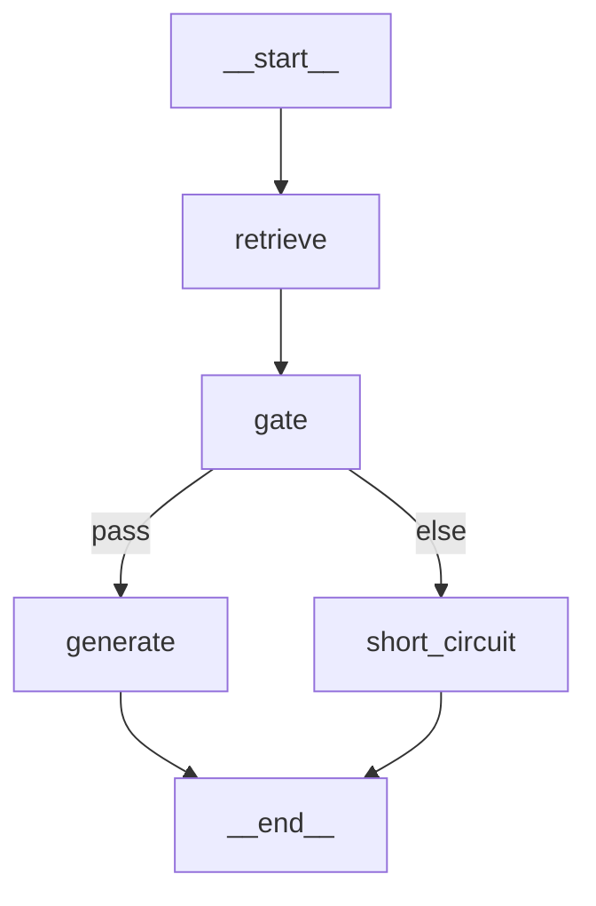
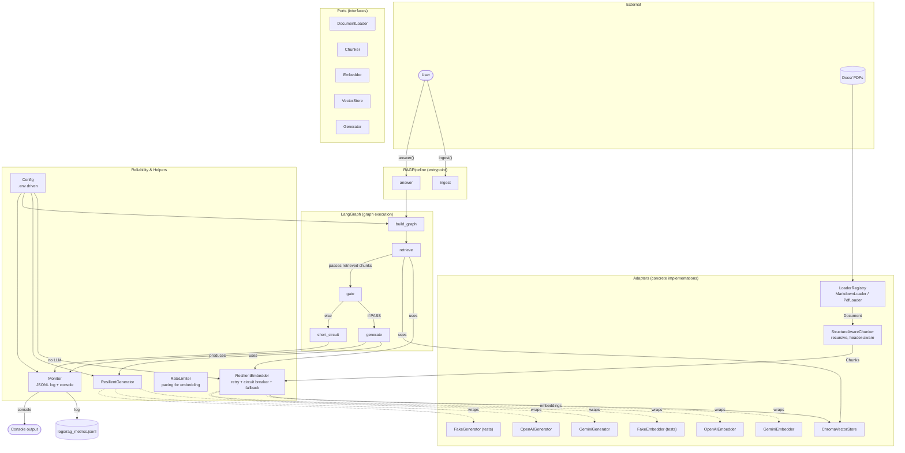

# Section 2 — LangChain / LangGraph RAG Pipeline

A small, standalone retrieval-augmented generation pipeline over a 3-document
knowledge base, built as a self-contained MVP that is deliberately shaped
like a production system: swappable providers, explicit failure handling,
structured monitoring, and a test suite that doesn't need any API key to run.
---

## Contents

- [What this is](#what-this-is)
- [Architecture](#architecture)
- [Setup](#setup)
- [Questions](#questions)
- [Usage](#usage)
- [Configuration reference](#configuration-reference)
- [Monitoring](#monitoring)
- [Design decisions](#design-decisions--where-to-read-more)
- [Known limitations](#known-limitations)

---

## What this is

- 3 PDFs:
  - `01_nist_800-145_cloud_computing.pdf` — NIST SP 800-145, "The NIST
    Definition of Cloud Computing" (2011): 5 essential characteristics,
    3 service models, 4 deployment models.
  - `02_nasa_our_solar_system.pdf` — NASA "Our Solar System" lithograph
    (2013):
  - `03_cdc_flu_vaccine_vis.pdf` — CDC Vaccine Information Statement for
    inactivated/recombinant influenza vaccine.
- Documents are chunked, embedded (Gemini by default, free tier), and stored
  in a local Chroma vector store.
- A LangGraph graph retrieves relevant chunks, gates on relevance (see
  below), and generates an answer with citations back to the source
  chunk/section.
- If no relevant context (Extreme cases) is found, the pipeline returns a clear "I don't
  know" message **without ever calling the LLM**.

**See `NOTES.md` for the required write-up and 3 example questions/answers.**

## Architecture

This is built as a small hexagonal / ports-and-adapters system, so that
swapping any piece (embedding provider, LLM provider, vector store) is a
one-file change, never a rewrite:

```
src/
  core/            domain types only (Document, Chunk, AnswerResult, ...) —
                   zero external dependencies
  ports/           abstract interfaces (DocumentLoader, Chunker, Embedder,
                   VectorStore, Generator)
  adapters/        concrete implementations behind each port
    loaders/         markdown & PDF loaders
    chunking/        structure-aware recursive chunker
    embeddings/      Gemini, OpenAI, and a fake (for tests)
    vectorstores/    Chroma
    generators/      Gemini, OpenAI, and a fake (for tests)
  application/     orchestration: Config, the LangGraph graph, reliability
                   (retry/circuit-breaker/fallback), monitoring, the
                   RAGPipeline entrypoint
```
---

---
---


---
**A host application only ever needs to import `RAGPipeline`:**

```python
from src.application.pipeline import RAGPipeline

pipeline = RAGPipeline()
pipeline.ingest("./docs")
result = pipeline.answer("How many essential characteristics does the NIST definition of cloud computing have?")
print(result.answer, result.citations)
```

### Graph shape (LangGraph)

```
retrieve -> gate --(relevant)-----> generate -> END
                 `-(not relevant)-> short_circuit -> END
```

`short_circuit` never calls the LLM. The "gate" step distinguishes two
different reasons for having no context (see NOTES.md for why this
distinction matters):

- **empty_index** — nothing has been ingested yet (a setup problem).
- **below_threshold** — chunks were retrieved, but none were relevant
  enough (the expected "your question isn't covered" case).
- **retrieval_failed** — the embedder or vector store call itself failed
  after retries (a system problem, handled by the reliability layer, not
  the content gate).

## Setup

### 1. Clone and enter the section 2 folder

```bash
cd section2_langchain_rag
```

### 2. Create a virtual environment and install dependencies

```bash
python3 -m venv .venv
source .venv/bin/activate        # Windows: .venv\Scripts\activate
pip install -r requirements.txt
```

### 3. Get a free Gemini API key

Get a key from [Google AI Studio](https://aistudio.google.com/apikey) (no
credit card required for the free tier).

### 4. Configure

```bash
cp .env.example .env
```

Open `.env` and paste your key into `GOOGLE_API_KEY=`. Everything else has
a working default.

### 5. Ingest the sample documents

```bash
python scripts/ingest.py
```

This chunks and embeds the 5 sample docs in `docs/` into a local Chroma
store at `./chroma_db` (git-ignored; safe to delete and re-run any time).

### 6. Ask a question

```bash
python scripts/ask.py "What is VAERS, and how do you report a reaction to it?"
```

Or run it interactively:

```bash
python scripts/ask.py
```

### 7. Run the fixed evaluation set (a diverse question bank, easy → hard → guardrail)

```bash
python scripts/eval.py --out logs/eval_results.md
```

Runs 5 questions against the real corpus, deliberately covering: easy
single-fact lookups, questions requiring a nuanced/negation reading within
one document, hard questions requiring synthesis across two different
documents, a "trap" question that superficially sounds like it's in scope
for one document but isn't, and guardrail questions with no relevant
answer in the corpus at all. See the category comments in
`scripts/eval.py` for the full breakdown. This is what generated the
results in `NOTES.md`.

### 8. Run the tests (no API key required)

```bash
pytest -v
```

All 69 tests run against fake/deterministic adapters — no network call, no
API key, and they run in a few seconds. This is what CI would run.

---

## Questions
- How many essential characteristics, service models, and deployment models does the NIST definition of cloud computing have?

- What is VAERS, and how do you report a reaction to it?

- Is the moon and distance data in this document current, and how should an answer handle that?

- What is the maximum towing capacity of a diesel pickup truck?

- How many moons does the cloud have, according to these documents?

---

## Usage

| Script | Purpose |
|---|---|
| `scripts/ingest.py` | Chunk + embed + index all files in `docs/` |
| `scripts/ask.py "question"` | Ask a single question |
| `scripts/ask.py` | Interactive Q&A loop |
| `scripts/eval.py` | Run the fixed evaluation question set, print + optionally save a report |

## Configuration reference

Every tunable lives in `.env` (see `.env.example` for the full list with
defaults) — nothing is hardcoded in source. Highlights:

| Variable | Purpose |
|---|---|
| `EMBEDDING_PROVIDER` / `GENERATION_PROVIDER` | `gemini` or `openai` |
| `FALLBACK_EMBEDDING_PROVIDER` / `FALLBACK_GENERATION_PROVIDER` | Optional automatic fallback provider |
| `CHUNK_SIZE_TOKENS` / `CHUNK_OVERLAP_TOKENS` | Chunking strategy |
| `RETRIEVAL_K` / `RELEVANCE_THRESHOLD` | Retrieval + the no-context gate |
| `ENABLE_NEIGHBOR_EXPANSION` | Pull in adjacent chunks around each retrieved chunk |
| `QUESTION_TOKEN_LIMIT` / `CONTEXT_TOKEN_BUDGET` | Guardrails (see NOTES.md) |
| `SKIP_UNCHANGED_CHUNKS_ON_INGEST` / `EMBEDDING_BATCH_SIZE` / `EMBEDDING_RPM_LIMIT` | Free-tier quota management on ingestion (see below) |
| `VERBOSE_CONSOLE` | Toggle the partial per-query console printout |
| `DEBUG_RETRIEVAL` | Toggle full per-chunk debug output for every query (see "Debug mode" below); also available per-call via `--debug` or `pipeline.answer(..., debug=True)` |

### Swapping providers

Set `EMBEDDING_PROVIDER=openai` and `GENERATION_PROVIDER=openai` (with
`OPENAI_API_KEY` set) to run entirely on OpenAI instead — no code change.
Setting `FALLBACK_GENERATION_PROVIDER=openai` alongside a Gemini primary
means Gemini failures automatically fail over to OpenAI after retries are
exhausted (see `src/application/reliability.py`).

## Managing free-tier quota on larger document sets

Gemini's free tier has both a per-minute rate limit and a daily quota
(roughly 100 RPM / 1,000 RPD for embeddings at time of writing — check
[ai.google.dev](https://ai.google.dev) for current numbers, these change).
A single clean ingest of even a large document set is usually only a
handful of requests (chunks are batched, not embedded one-by-one), but
**re-running `ingest.py` repeatedly during development re-embeds
everything from scratch by default in most naive setups** — this project
avoids that specifically:

- **Idempotent ingestion (on by default).** Each chunk's content hash
  (SHA-256, stored alongside it in Chroma's metadata) is compared against
  what's already indexed; re-running `ingest.py` skips any chunk that's
  already indexed and unchanged, so iterating on your docs during
  development doesn't repeatedly burn quota on content you already
  embedded. Use `python scripts/ingest.py --force` to bypass this and
  re-embed everything (needed if you change `CHUNK_SIZE_TOKENS`,
  `CHUNK_OVERLAP_TOKENS`, or the embedding model, since the same chunk_id
  may now need a different embedding).
  it's the same content-addressable-hash pattern build tools (make,
  Bazel), package managers (npm/pip lockfiles), and static site generators
  use to skip unchanged work, and specifically *because* embedding calls are the scarce/rate-limited resource in this pipeline. See `src/application/content_hash.py` and `VectorStore.get_existing_content_hashes()`.
- **`EMBEDDING_RPM_LIMIT`** (0 = off): proactively paces embedding calls
  during ingestion instead of only reacting to a 429 after it happens. Set
  it to something safely under your plan's actual RPM (e.g. `90`) if
  you're ingesting a large corpus on the free tier.
- **Quota errors are surfaced clearly.** A 429/quota-exceeded failure is
  detected and raises a distinct error/message rather than a generic
  "something went wrong" — see `QuotaExceededError` in
  `src/application/exceptions.py`. Retrying a quota error immediately
  never helps, so the reliability layer fails fast instead of burning
  through retry attempts and backoff delay for no benefit.

## Monitoring

Every query produces one structured JSON line in `logs/rag_metrics.jsonl`,
covering both RAG metrics (retriever latency, chunks retrieved, similarity
scores, no-context events) and LLM metrics (prompt/completion/total tokens,
estimated cost, generation speed, model used, latency). This log doubles as
the eval dataset for tuning `RELEVANCE_THRESHOLD`.

The console additionally prints one summary line per query when
`VERBOSE_CONSOLE=true` (the default) — deliberately partial, not a full
dump:

```
[rag] gate=pass chunks=4 top_score=0.630 model=gemini-2.5-flash tokens=288 cost=$0.00000 latency=612ms
```

`pipeline.stats()` (also printed at the end of `ask.py`'s interactive mode
and `eval.py`) aggregates the session: explicit pass/no-context counts
(`gate_passed: "8/10"`), average latency, average similarity score, total
cost, total tokens, and how many chunks were dropped for budget or added
via neighbor expansion across the whole run.

### Debug mode — full per-chunk detail (opt-in)

The console line above is deliberately partial by design. When you
actually need to see *why* a query landed where it did — tuning
`RELEVANCE_THRESHOLD`, investigating a wrong-document retrieval, checking
whether trimming or neighbor-expansion fired — turn on debug mode instead
of making the default output noisier for everyone:

```bash
python scripts/ask.py --debug "What does MUST NOT mean?"
python scripts/eval.py --debug
```

or set `DEBUG_RETRIEVAL=true` in `.env` to make it the default for every
call. Output looks like (this specific example was generated offline with
the deterministic test embedder to document the format, not as a
retrieval-quality claim — hence chunk #2 below being from the wrong
document; a real embedding model should rank all top chunks from the CDC
document for this question):

```
[debug] Question: 'What is VAERS?'
[debug] Retrieved 4 chunk(s), relevance threshold=0.150:
  #1 PASS       score=0.287  03_cdc_flu_vaccine_vis::chunk::1  (docs/03_cdc_flu_vaccine_vis.pdf, page=2)
       "OFFICE USE ONLY 42 U.S.C. § 300aa-26 1/31/2025 Vaccine Information..."
  #2 PASS       score=0.270  01_nist_800-145_cloud_computing::chunk::4  (docs/01_nist_800-145_cloud_computing.pdf, page=5)
       "1 1. Introduction 1.1 Authority The National Institute of Standards..."
[debug] Note: only the TOP score decides the gate (below-thr on a lower-ranked
chunk here doesn't reject the query by itself).
[debug] Gate decision: PASS -- top score cleared the threshold, generation ran.
```

Every chunk shows its score, a text preview, its source (with page number
for PDFs or section path for markdown), and whether it individually clears
the configured threshold — with an explicit note that only the *top*
chunk's score actually decides the gate, so a `below-thr` line further
down the list isn't itself a rejection. Also reports neighbor-expansion
and budget-trimming when either fired for that query. `pipeline.answer(question, debug=True)` is available directly if you're scripting against the pipeline rather than the CLI.

## Design decisions — where to read more

The reasoning behind the choices below is written up in `NOTES.md`:
chunking strategy and its trade-offs on long documents; why Chroma over
FAISS/MongoDB/Pinecone for this task; why hybrid search/re-ranking were
deliberately deferred; the two-way split of "no context found"
(empty vs. below-threshold) vs. system failure; the token-limit guardrail
(reject vs. trim); memory as a stateless pass-through; multi-source
citation grouping; and neighbor-chunk expansion.

## Known limitations

- The relevance threshold (`RELEVANCE_THRESHOLD=0.66`) was set by hand
  against the 5 sample docs; on a different document set it should be
  re-tuned using the query log (see NOTES.md).
- The context-budget trimming step uses an approximate character-based
  token estimate, not an exact tokenizer (deliberate — see
  `src/application/token_utils.py` for why).
- `ResilientEmbedder`/`ResilientGenerator` implement retry + circuit
  breaker + fallback-provider logic, but the OpenAI fallback path is **only exercised in tests with fakes, not against a live OpenAI account**, since
  the task only asked for one working provider.
