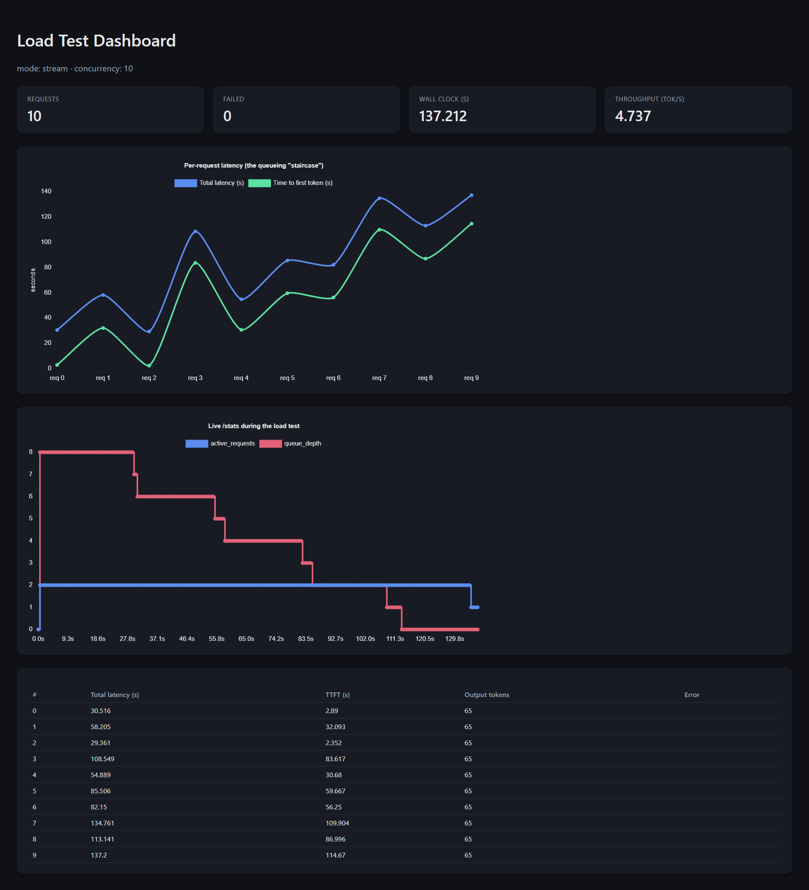

# Section 4 — Model Deployment

A FastAPI service wrapping Section 3's `HFTransformersEngine` (same engine,
same fallback mechanisms) behind a FAST API,
with token streaming, containerization, and a concurrent load test.

> **Why FastAPI, not vLLM/TGI:** " vLLM's CPU backend is experimental and unreliable to build in
> a 10-minute setup; FastAPI wrapping the already-tested, portable Section 3
> engine satisfies that directly, without a rewrite. vLLM/TGI are the correct
> answer for production-scale concurrency (continuous batching) — see
> `NOTES.md` for where they'd actually get used, at 50 concurrent users.

## Two ways to run this, on purpose

| Path | Use for | Model | Device |
|---|---|---|---|
| **Docker** (Section 1 below) | Proving `docker build && docker run` works end-to-end, anywhere | Qwen2.5-1.5B-Instruct (small, safe default) | CPU (guaranteed to work without a GPU) |
| **Native** (Section 2 below) | Real load-test numbers, using your GPU | Qwen2.5-3B-Instruct (same as Section 3) | GPU |

Docker proves portability (required); the native GPU run is optional

---

## 1. Docker (portability check — run this first)

```bash
docker build -t section4-api .
docker run -p 8000:8000 section4-api
```

Wait for `Model ready` in the logs, then in another terminal:
```bash
curl http://localhost:8000/health
```
Expect `"ready": true`. That's the "runs end-to-end on any device" proof —
CPU-only, small model, no GPU or extra setup required.

To stop: `Ctrl+C`, or `docker ps` + `docker stop <container_id>`.

**Persisting the model cache across container restarts** (avoids
re-downloading every `docker run`):
```bash
docker run -p 8000:8000 -v hf_cache:/app/hf_cache section4-api
```
**to change the Max concurrent generation**
```bash
docker run -p 8000:8000 -v hf_cache:/app/hf_cache -e MAX_CONCURRENT_GENERATIONS=2 section4-api
```

### Optional / advanced: GPU inside Docker

if you want it: install the [NVIDIA Container
Toolkit](https://docs.nvidia.com/datacenter/cloud-native/container-toolkit/latest/install-guide.html),
then swap the Dockerfile's CPU torch install line for the CUDA build (same
command as README's native GPU install below), and run with `--gpus all -e
DEVICE_MODE=gpu`. On Windows this requires the NVIDIA WSL2 driver + Docker
Desktop's WSL2 backend.

---

## 2. (Optional) Native run with your GPU

Docker container defaults to CPU + a small model, deliberately, for
guaranteed portability. 
but nobody runs concurrent LLM serving on CPU in production.

### RTX 50-series (Blackwell) / CUDA 12.8 nightly fallback
```bash
pip install --pre torch torchvision torchaudio --index-url https://download.pytorch.org/whl/nightly/cu128
pip install -r requirements.txt
```
```powershell
$env:MODEL_ID = "Qwen/Qwen2.5-3B-Instruct"; $env:PRECISION = "fp16"; $env:DEVICE_MODE = "gpu"
uvicorn app.main:app --host 0.0.0.0 --port 8000
```
```bash
# bash/zsh
MODEL_ID=Qwen/Qwen2.5-3B-Instruct PRECISION=fp16 DEVICE_MODE=gpu uvicorn app.main:app --host 0.0.0.0 --port 8000
```

### Verify + test (no GPU/model needed for this part)
```bash
python scripts/check_environment.py
```
```bash
pytest tests/ -v
```
21 tests cover the full API surface (health states, generate, streaming,
`/stats`, and a real concurrency test proving the queueing semaphore
actually queues) using a fake engine — no GPU, model, or network required.

---

## API reference

### `GET /health`
```json
{"status": "ok", "ready": true, "model_id": "Qwen/Qwen2.5-3B-Instruct", "precision": "fp16", "device": "cuda", "fallback_triggered": false}
```

### `GET /stats` (live monitoring)
```json
{"active_requests": 1, "queue_depth": 3, "total_requests_served": 47, "total_requests_failed": 0, "avg_generation_time_s": 4.2, "max_concurrent_generations": 1}
```
Live, curl-able snapshot of what the server is doing *right now* —
complements `/health` (readiness) and `results/metrics.jsonl` (historical
log). `active_requests` and `queue_depth` are driven directly by the same
`threading.Semaphore` that serializes GPU access (see "Concurrency design"
below) — this isn't a separate bookkeeping system, it's instrumenting the
real one. Poll it while a load test runs:
```bash
while ($true) {                                                                                
Clear-Host
curl http://localhost:8000/stats
Start-Sleep -Milliseconds 1500
}
```
or for Linux
```bash
watch -n 0.5 curl -s http://localhost:8000/stats
```

### `POST /generate` (non-streaming)
```bash
Invoke-RestMethod -Uri http://localhost:8000/generate `
  -Method POST `
  -ContentType "application/json" `
  -Body '{"prompt":"Explain quantization in one sentence.","max_new_tokens":100}'
```

```json
{"output": "...", "output_tokens": 42, "generation_time_s": 1.8, "tokens_per_second": 23.3, "precision": "fp16", "device": "cuda"}
```

## Manual interactive testing (and ad-hoc concurrency testing)
```bash
python scripts/interactive_client.py --url http://localhost:8000
```
Type a prompt, watch tokens print live as they stream in — a quick visual
confirmation that streaming actually streams, not just buffers and dumps at
the end. **Run this script in multiple terminals at once** to manually
generate concurrent load against the same running server (Docker or
native) — a human-driven complement to `load_test.py`, useful for eyeballing
`/stats` update in real time as requests queue up behind each other.

## Load / latency test (10 concurrent requests)

With the API running (either path above):

```bash
python scripts/load_test.py --url http://localhost:8000 --concurrency 10 --stream --timeout 180 --report
```

Reports, per request and aggregated (min/avg/median/p95/max): **total
latency** and **time-to-first-token** (measured from the streaming endpoint,
since non-streaming has no meaningful TTFT distinct from total latency), plus
aggregate throughput across the whole concurrent batch. Full results saved to
`results/load_test.json`; summary printed to stdout — paste it into
`NOTES.md`.

Run without `--stream` to test the non-streaming endpoint instead (measures
total latency only, no TTFT).

**Generate a report automatically** — add `--report` to the command above,
or run it separately against an existing results file:
```bash
python scripts/generate_load_test_report.py --input results/load_test.json
```
Produces `results/load_test_report.md` (readable table version) and
`results/load_test_dashboard.html` (charts: per-request latency "staircase"
showing the queueing effect, plus a live `active_requests`/`queue_depth`
timeline if `--stats-poll` was on during the run — it is by default).

---

## Concurrency design (this is the "queueing" the write-up talks about)
calls run against the model at once, enforced with a `threading.Semaphore`
in `app/model_service.py`, shared identically by both the streaming and
non-streaming paths. Extra requests queue behind the semaphore rather than
racing for VRAM/RAM or corrupting shared model state. This is exactly the bottleneck `NOTES.md` explains how to remove at 50 users
(batching inference servers instead of a semaphore).

Raise it if you want to experiment: `-e MAX_CONCURRENT_GENERATIONS=2` (only
meaningful with enough VRAM/RAM headroom for concurrent forward passes).

---

### Results

---


## Project structure

```
section4_deployment/
├── Dockerfile                    # CPU-only, small-model default -- portability proof
├── requirements.txt
├── app/
│   ├── main.py                   # FastAPI app (factory pattern -- testable without a real model)
│   ├── model_service.py          # concurrency control (semaphore) + live /stats + Section 3's MetricsLogger reuse
│   ├── schemas.py                # request/response models
│   └── config.py                 # env-var settings
├── src/                          # copied from Section 3
│   ├── engines/
│   │   ├── base.py                 # + generate_stream() added for Section 4
│   │   └── transformers_engine.py  # + TextIteratorStreamer-based streaming added
│   ├── monitoring/
│   │   ├── snapshot.py, metrics_logger.py, dashboard.py  # unchanged from Section 3
│   │   └── load_test_report.py     # NEW: turns load_test.json into a report + HTML dashboard
│   ├── device.py, exceptions.py, utils.py  # unchanged
├── scripts/
│   ├── check_environment.py      # unchanged from Section 3
│   ├── download_model.py         # unchanged from Section 3
│   ├── load_test.py              # concurrent load/latency test, with live /stats polling
│   ├── generate_load_test_report.py  # NEW: regenerate report/dashboard from a saved JSON
│   └── interactive_client.py     # NEW: manual streaming client, runnable in parallel for ad-hoc load
├── tests/
│   ├── test_api.py                # 14 tests: health, generate, streaming, /stats, real concurrency proof
│   ├── test_load_test.py          # 4 tests for the stats-aggregation logic
│   └── test_load_test_report.py   # 3 tests for the report/dashboard generator
├── results/                       # metrics.jsonl, load_test.json, load_test_report.md, dashboard.html land here
└── NOTES.md                       # write-up (fill in after running the load test)
```

## Design notes / trade-offs

- `app/main.py` uses a factory (`create_app(service)`) specifically so
  `tests/test_api.py` can inject a fake engine — same "test the harness
  without needing the model" philosophy as Section 3.
- Streaming and non-streaming paths share one `threading.Semaphore` for
  concurrency control, so both are equally protected against concurrent GPU
  access regardless of which endpoint is hit.
- Startup failures don't crash the process — `/health` reports `ready: false`
  instead, so the container doesn't loop on crash-restart if the model fails
  to load (e.g. a bad `MODEL_ID` env var), which is friendlier for a
  10-minute setup.
